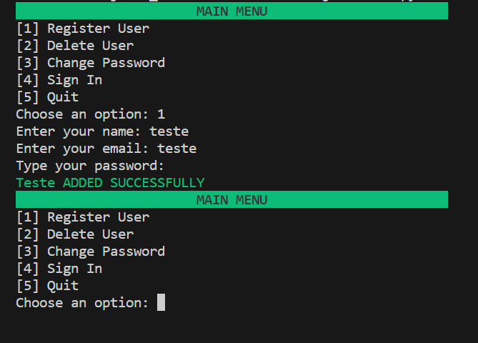
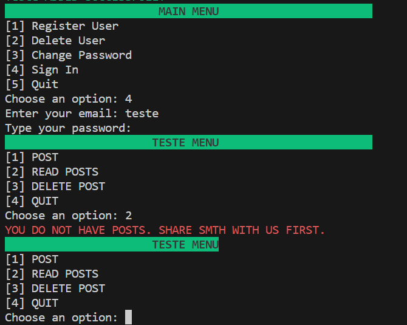
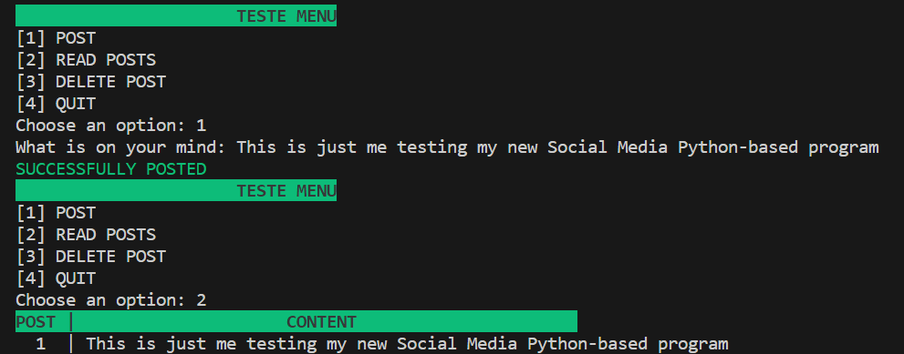
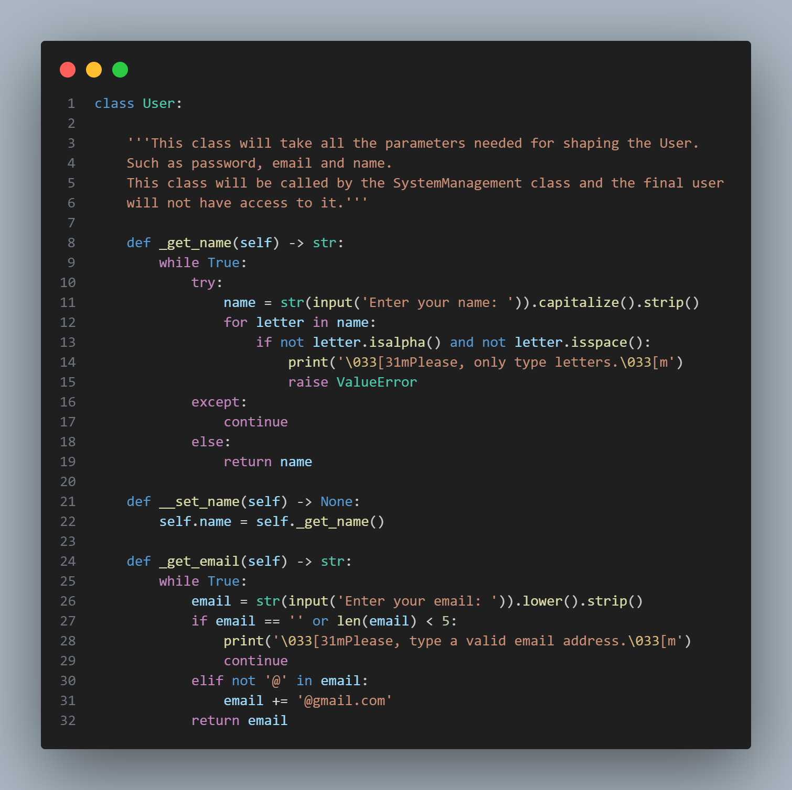
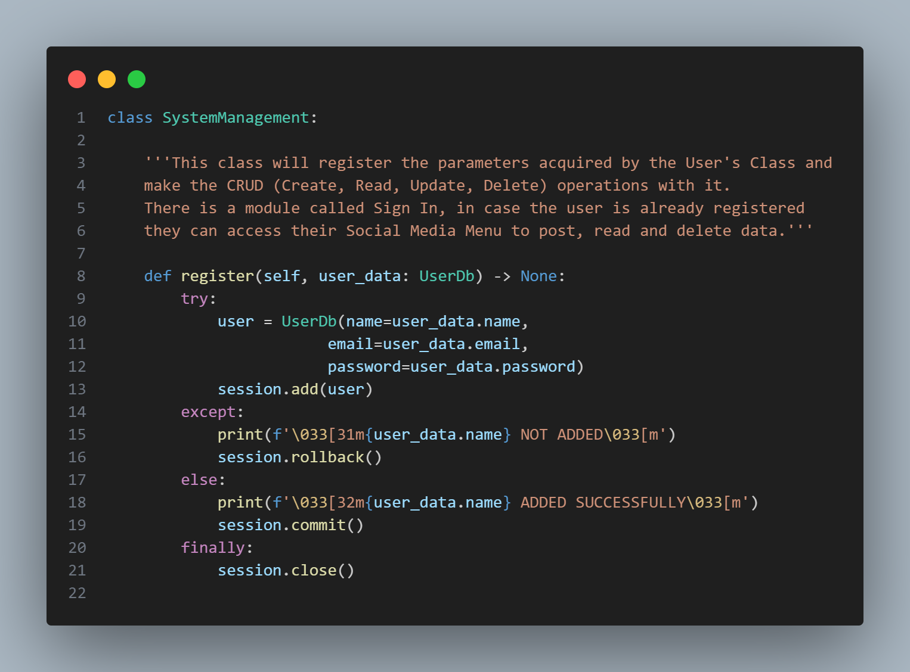
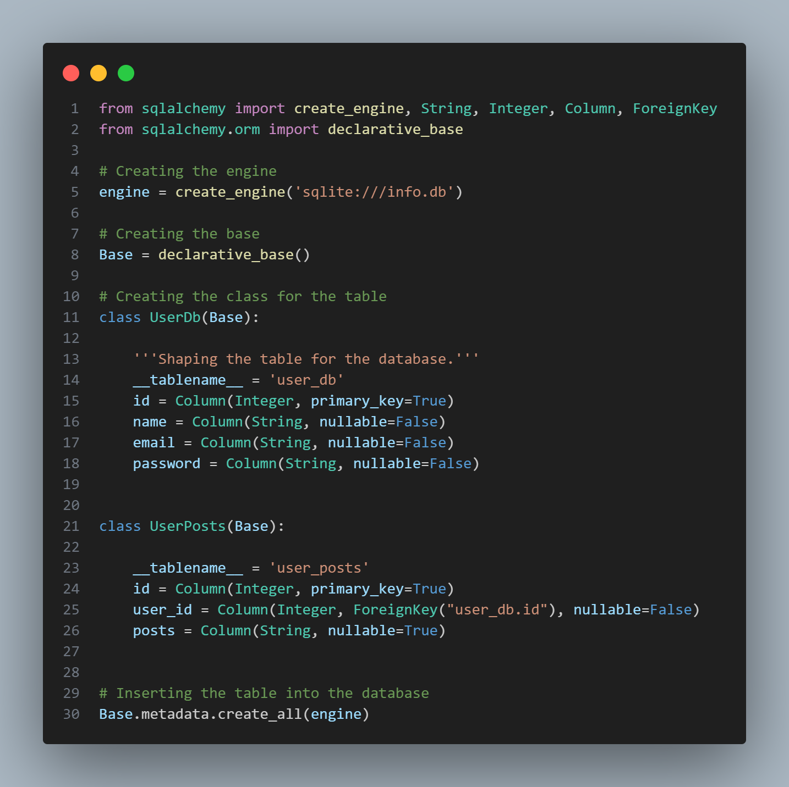

<h1 align="center">🤳 Small Social Media</h1>

### 📝 DESCRIPTION

<p align="justify">This program is a Python-based application that leverages SQLAlchemy for efficient database management. It’s designed to handle CRUD (Create, Read, Update, Delete) operations for a user. The unique feature of this program is its built-in social media functionality. Users can create text posts, view their own posts, and if needed, delete them. This program essentially combines the functionalities of a database management system with a personal social media platform.</p>


### ⏭️ TABLE OF CONTENTS
1. Description
2. Requirements
3. Run the project
4. Contribute
5. Screenshots

### 💻 REQUIREMENTS
- [Python3](https://docs.python.org/3/)
- [VisualCode](https://code.visualstudio.com/docs)
- [SQLAlchemy](https://docs.sqlalchemy.org/en/20/)

### 🚀 HOW TO RUN THE PROJECT
```bash
$ pip install sqlalchemy
You will download the files and run the view.py script.
```


### 📫 HOW TO CONTRIBUTE
```bash 
# Fork this repository:
By clicking on the fork button on the top of this page. This will create a copy of this repository in your account.

# Clone this project:
git clone https://github.com/BLUCASS/Streaming_System

# Create a branch using the command:
git checkout -b your-new-branch-name

# Make the changes and commit them:
git commit -m "commit-message"

# Send them to the original branch:
git push file-origin project-name / local
```

### 📸 SCREENSHOTS
<br>
<br>
<br>
<br>
<br>

